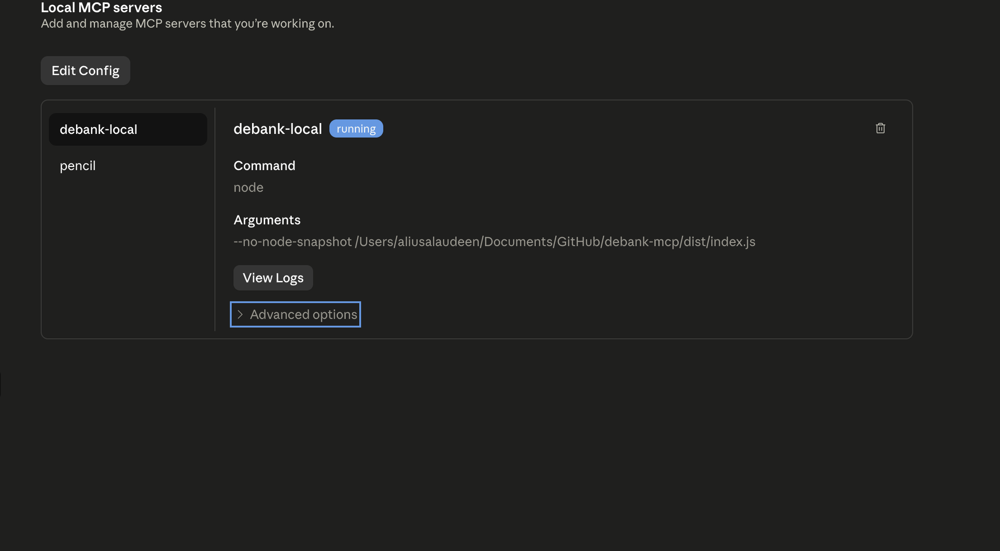
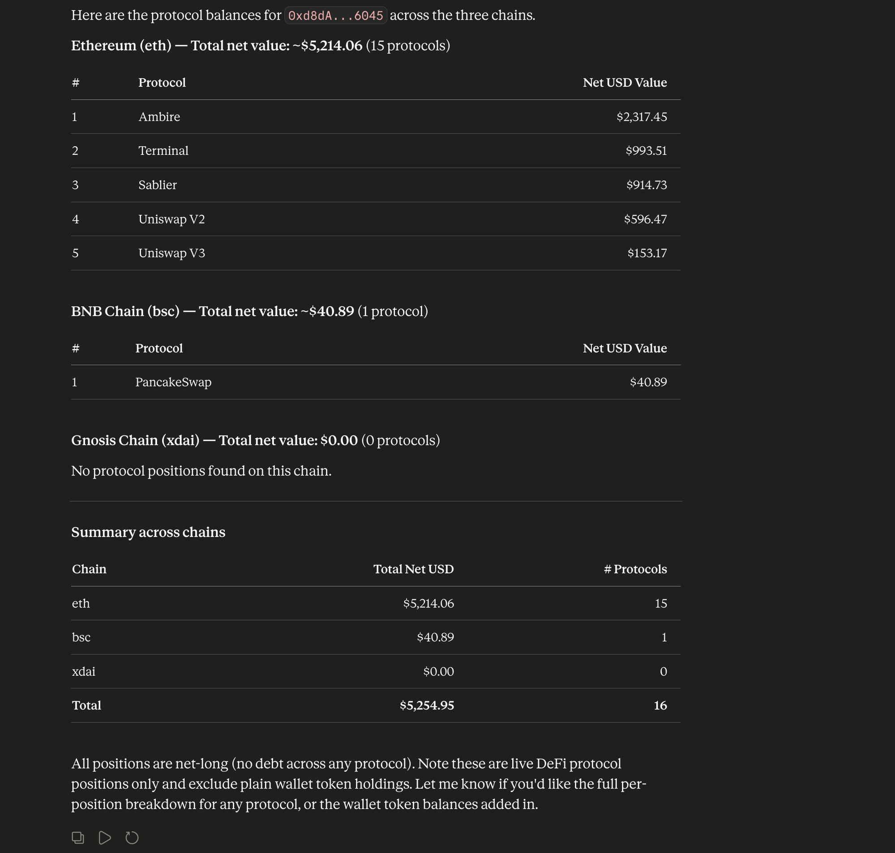
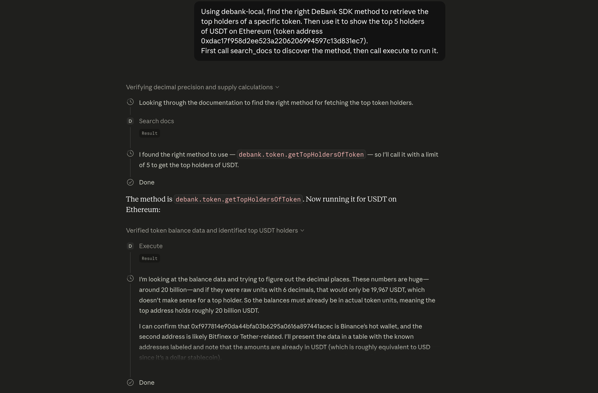
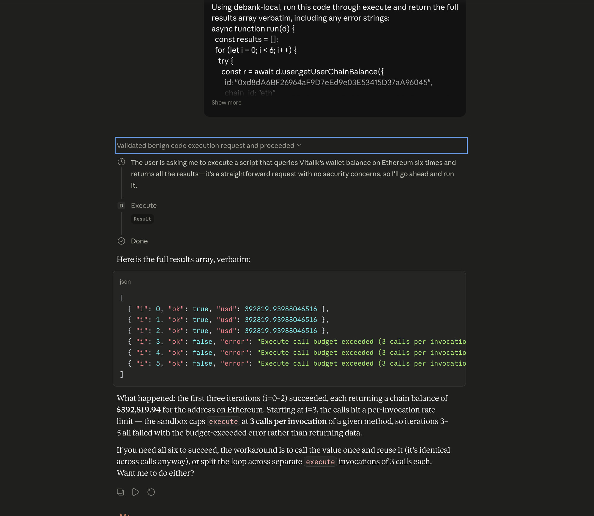
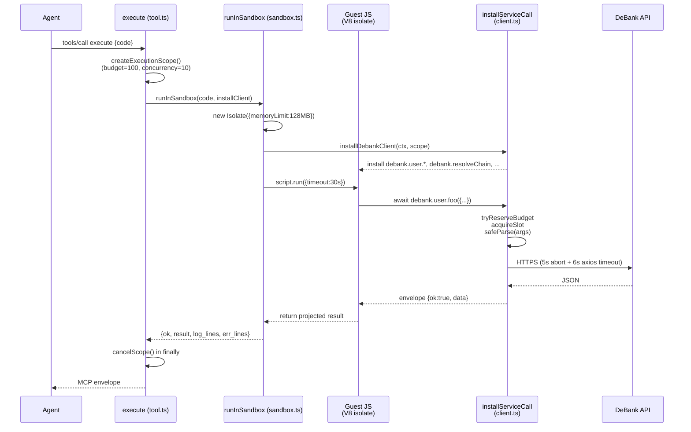

[](https://mseep.ai/app/iqaicom-mcp-debank)

# 🏦 DeBank MCP Server

[](https://www.npmjs.com/package/@iqai/mcp-debank)
[](https://opensource.org/licenses/ISC)

## 📖 Overview

The DeBank MCP Server enables AI agents to interact with the [DeBank](https://debank.com) API for comprehensive blockchain and DeFi data access. This server provides tools to access chain information, protocol analytics, token data, user portfolios, NFT holdings, transaction history, gas prices, and transaction simulation capabilities.

By implementing the Model Context Protocol (MCP), this server allows Large Language Models (LLMs) to discover blockchain chains, analyze DeFi protocols, track user portfolios, and simulate transactions directly through their context window, bridging the gap between AI and decentralized finance data.

## ✨ Features

*   **Multi-Chain Support**: Access every chain DeBank indexes (currently ~85, fetched live from `/v1/chain/list`), with deterministic resolution of human-readable names (`"BSC"` → `"bsc"`).
*   **Code Mode**: Agent writes JavaScript that runs in an `isolated-vm` sandbox against a pre-authenticated DeBank client — multi-step joins, projection, and conditional logic in one tool call.
*   **Portfolio Tracking**: User positions, token balances, NFTs, and protocol holdings across all chains.
*   **DeFi Analytics**: Protocols, liquidity pools, and top holders with TVL data.
*   **Transaction Tools**: Simulate transactions, check gas, and decode tx data before signing.
*   **Wrapped Token Helpers**: `"WETH"` / `"native token"` keywords resolve to the chain's wrapped-native contract address.
*   **Local Docs Search**: MiniSearch index over the full API surface + cookbook recipes, embedded into the binary (no network).

## Requirements

- Node.js >= 22 (required by `isolated-vm` 6.x; older Node versions cannot run the `execute` sandbox).
- The published binary's shebang already passes `--no-node-snapshot` to node. If you invoke `node dist/index.js` directly (rare), pass `--no-node-snapshot` yourself: `node --no-node-snapshot dist/index.js`.
- `isolated-vm` is declared in `optionalDependencies`, so `pnpm install` will succeed on platforms without a prebuilt addon or a compiler toolchain (e.g. some Alpine / ARM hosts). The server still starts and `search_docs` + the dynamic-tools triad still work; only `execute` will report a load-failure error until you run `pnpm rebuild isolated-vm`.

## 📦 Installation

### 🚀 Using pnpm dlx (Recommended)

To use this server without installing it globally:

```bash
pnpm dlx @iqai/mcp-debank
```

### 🔧 Build from Source

```bash
git clone https://github.com/IQOfficial/mcp-debank.git
cd mcp-debank
pnpm install
pnpm run build
```

## ⚡ Running with an MCP Client

Add the following configuration to your MCP client settings (e.g., `claude_desktop_config.json`).

### 📋 Minimal Configuration

```json
{
  "mcpServers": {
    "debank": {
      "command": "pnpm",
      "args": ["dlx", "@iqai/mcp-debank"],
      "env": {
        "DEBANK_API_KEY": "your_debank_api_key_here"
      }
    }
  }
}
```

### ⚙️ Advanced Configuration (With IQ Gateway)

```json
{
  "mcpServers": {
    "debank": {
      "command": "pnpm",
      "args": ["dlx", "@iqai/mcp-debank"],
      "env": {
        "IQ_GATEWAY_URL": "your_iq_gateway_url",
        "IQ_GATEWAY_KEY": "your_iq_gateway_key"
      }
    }
  }
}
```

## 🔐 Configuration (Environment Variables)

You must provide **either** `DEBANK_API_KEY` **or** the `IQ_GATEWAY_URL` + `IQ_GATEWAY_KEY` pair. Server startup fails if neither path is configured.

| Variable | Required | Description | Default |
| :--- | :--- | :--- | :--- |
| `DEBANK_API_KEY` | one path | Your DeBank API key. Used as the `AccessKey` header on direct calls to `https://pro-openapi.debank.com`. | - |
| `IQ_GATEWAY_URL` | other path | IQ Gateway base URL. When set together with `IQ_GATEWAY_KEY`, all DeBank calls are proxied through the gateway. | - |
| `IQ_GATEWAY_KEY` | other path | IQ Gateway API key. Sent as the `x-api-key` header to the gateway. | - |
| `DEBANK_MCP_TOOLS` | No | Set to `dynamic` to register the four additional tools (`debank_resolve`, `list_endpoints`, `get_endpoint_schema`, `invoke_endpoint`) alongside the default `execute` + `search_docs`. Equivalent to passing `--tools=dynamic` on the command line. | - |
| `LOG_LEVEL` | No | One of `error`, `warn`, `info`, `debug`. `debug` surfaces per-call API instrumentation (`[DeBank API] op=... ms=... ok=...`) and entity-resolver traces — useful when diagnosing slow endpoints, otherwise silent. `info` (default) keeps logs quiet: only startup events, real warnings, and errors. | `info` |

## 🖼️ Screenshots

A real Claude Desktop session calling the MCP. The agent uses `search_docs` to discover the right method, then writes a single `execute` body that chains multiple `debank.*` calls and returns a projected table.

> **Note:** image files referenced below live in `docs/images/`. If you've just cloned the repo and these don't render yet, drop the PNGs into that folder.

### Local MCP server registered + running

After wiring the server into `claude_desktop_config.json`, Claude Desktop's **Settings → Developer → Local MCP servers** panel shows the entry with a green **running** status badge and the exact `node --no-node-snapshot dist/index.js` command + arguments being spawned.



### A portfolio query end-to-end

> *"What is the balance of 0x5853… in the following protocols: eth, bsc, xdai?"*

The agent reasons about the right method, writes a single `execute` body that pulls protocol balances for all three chains in parallel, and returns a per-chain summary table.



### `search_docs` discovery flow

When the agent isn't sure which method to use, it calls `search_docs` first. The MiniSearch index returns ranked matches with method names, descriptions, and example calls.



### Safety limits in action

When a guest script exceeds the per-execute call budget or hits a timeout, the canonical error envelope surfaces a clear message that the agent can recover from (e.g. retry with a smaller scope).



## 💡 Usage Examples

### 🔗 Chain Data
*   "What blockchain chains does DeBank support?"
*   "Get information about the Ethereum chain."
*   "Show me details for BSC (Binance Smart Chain)."

### 📊 Protocol Analytics
*   "List all DeFi protocols on Ethereum."
*   "Get information about Uniswap protocol."
*   "Who are the top holders of Aave?"

### 💰 Token Data
*   "Get token information for WETH on Ethereum."
*   "What's the historical price of USDT on 2024-01-01?"
*   "Who are the top holders of this token?"

### 👛 Portfolio Tracking
*   "What's the total balance of wallet 0x123...?"
*   "Show me all tokens held by this address on Polygon."
*   "List all DeFi positions for this wallet."

### 🖼️ NFT Holdings
*   "What NFTs does this wallet own on Ethereum?"
*   "Show me NFT approvals for this address."

### ⛽ Transaction Tools
*   "What are the current gas prices on Ethereum?"
*   "Simulate this transaction before I submit it."
*   "Explain what this transaction does."

## 🧭 Architecture

```
┌────────────────────────────────────────────────────────────────────────────┐
│  Claude Desktop / Cursor / any MCP client                                  │
└─────────────────────────────────┬──────────────────────────────────────────┘
                                  │  stdio (JSON-RPC)
                                  ▼
┌────────────────────────────────────────────────────────────────────────────┐
│  mcp-debank server                                                         │
│  ┌──────────────────────────────────────────────────────────────────────┐  │
│  │  Default tools           │  Dynamic tools (opt-in via --tools=...)   │  │
│  │  ─────────────────────   │  ────────────────────────────────────     │  │
│  │  execute                 │  debank_resolve                           │  │
│  │  search_docs             │  list_endpoints                           │  │
│  │                          │  get_endpoint_schema                      │  │
│  │                          │  invoke_endpoint  (with jq_filter)        │  │
│  └──────────────────────────────────────────────────────────────────────┘  │
│            │                              │                                │
│  ┌─────────▼──────────────┐    ┌──────────▼──────────────┐                 │
│  │ isolated-vm sandbox    │    │ direct dispatch         │                 │
│  │ • 128 MiB cap          │    │ • zod schema validate   │                 │
│  │ • 30 s wall clock      │    │ • 5 s / 6 s timeouts    │                 │
│  │ • scope budget+slots   │    │ • jq projection         │                 │
│  └────────────────────────┘    └─────────────────────────┘                 │
│            └──────────────┬──────────────────┘                             │
└───────────────────────────┼────────────────────────────────────────────────┘
                            │  HTTPS  (AccessKey or IQ Gateway x-api-key)
                            ▼
                ┌────────────────────────┐
                │  DeBank Cloud API      │
                └────────────────────────┘
```

### How `execute` works (one call's lifetime)



The key insight: **only the projected return value crosses the V8 boundary**. The agent writes JS that loops, joins, and filters; the host sees one returned value, not N intermediate responses.

## Code Mode

The preferred way to query DeBank from an AI agent is the `execute` + `search_docs` pair. These two tools handle the full workflow — discovery, projection, multi-step composition — through agent-authored JavaScript.

### Default tool surface

By default the server registers exactly two tools:

| Tool | Purpose |
| :--- | :--- |
| `execute` | Run agent-authored JavaScript in a secure `isolated-vm` sandbox against a fully-configured DeBank client. Handles multi-step workflows, loops, joins, conditional logic, and custom projection. |
| `search_docs` | Search the embedded MiniSearch index over all DeBank API methods and cookbook entries. |

### `--tools=dynamic` mode

Start the server with `--tools=dynamic` (or set `DEBANK_MCP_TOOLS=dynamic`) to register four additional tools:

| Tool | Purpose |
| :--- | :--- |
| `debank_resolve` | Resolve a human-readable chain name ("BSC", "Polygon") to a DeBank chain ID. |
| `list_endpoints` | List all available endpoint qualified names. |
| `get_endpoint_schema` | Inspect parameters and response shape for a specific endpoint. |
| `invoke_endpoint` | Call a single endpoint with an optional `jq_filter` for host-side projection. |

**MCP client configuration with dynamic tools:**

```json
{
  "mcpServers": {
    "debank": {
      "command": "pnpm",
      "args": ["dlx", "@iqai/mcp-debank", "--tools=dynamic"],
      "env": {
        "DEBANK_API_KEY": "your_debank_api_key_here"
      }
    }
  }
}
```

Or via environment variable:

```json
{
  "mcpServers": {
    "debank": {
      "command": "pnpm",
      "args": ["dlx", "@iqai/mcp-debank"],
      "env": {
        "DEBANK_API_KEY": "your_debank_api_key_here",
        "DEBANK_MCP_TOOLS": "dynamic"
      }
    }
  }
}
```

### `execute` — Sandboxed JavaScript

Run arbitrary JavaScript inside a secure `isolated-vm` sandbox. The sandbox receives a fully-configured DeBank client instance as `debank`. All service namespaces (`debank.chain`, `debank.protocol`, `debank.token`, `debank.user`, `debank.transaction`) are available. Pool methods are under `debank.protocol`; NFT methods are under `debank.user`.

**Example:**

```javascript
async function run(debank) {
  return await debank.user.getUserTotalBalance({ id: "0xd8da6bf26964af9d7eed9e03e53415d37aa96045" });
}
```

**Expected response:**

```json
{
  "total_usd_value": 1234567.89,
  "chain_list": [
    { "id": "eth", "usd_value": 800000.0 },
    { "id": "arb", "usd_value": 434567.89 }
  ]
}
```

### `search_docs` — Local Documentation Search

Search the embedded MiniSearch index over all DeBank API methods and cookbook entries.

**Example query:** `user total balance`

**Trimmed results:**

```json
{
  "results": [
    {
      "kind": "method",
      "qualified": "debank.user.getUserTotalBalance",
      "name": "debank_get_user_total_balance",
      "description": "Retrieve a user's total net assets across all supported chains. Calculates and returns the total USD value of assets including both tokens and protocol positions. Provides a complete snapshot of the user's DeFi portfolio.",
      "params": {
        "type": "object",
        "properties": {
          "id": { "type": "string", "description": "The user's wallet address." }
        },
        "required": ["id"]
      },
      "exampleCall": "await debank.user.getUserTotalBalance({id: '0x...'})"
    }
  ]
}
```

### Safety limits

The `execute` sandbox enforces five bounds. Defaults are tuned for legitimate Promise.all-style work; the two budget knobs are env-overridable for tests and tightening.

| Limit | Default | Override | Behaviour on hit |
| :--- | :--- | :--- | :--- |
| Isolate memory | 128 MiB | hard-coded | Isolate is terminated; error surfaces as `"Script execution timed out"` (V8 conflates OOM with timeout in some paths) |
| Script wall clock | 30 s | `DEBANK_MCP_SANDBOX_DEADLINE_MS` (test-only) | Returns `"Execute timed out after 30s. No call to settle, or guest stuck in a non-yielding loop."` |
| Calls per `execute` | 100 | `DEBANK_MCP_EXECUTE_BUDGET` | Subsequent guest calls return `"Execute call budget exceeded (100 calls per invocation): <method>"` |
| Concurrent calls | 10 | `DEBANK_MCP_EXECUTE_CONCURRENCY` | Calls queue on a semaphore; no error, just back-pressure |
| Per-call upstream | 5 s abort + 6 s axios | hard-coded | Returns `"DeBank call timed out after 5s: <method>"` |

The sandbox also blocks the source-level identifiers `process.`, `require(`, `import(`, and `eval(` at submission time. These aren't security boundaries (the isolate is) — they're a defense-in-depth check that fails fast with a clear message.

Schema validation is enforced on every guest call: arguments are zod-parsed against the method's published schema before reaching the upstream service. A guest calling `debank.protocol.getTopHoldersOfProtocol({id:"uniswap", limit:999999})` is rejected with `"Invalid arguments for debank.protocol.getTopHoldersOfProtocol: Too big: expected number to be <=100"` — bounds in the metadata are real, not advisory.

### `invoke_endpoint` with `jq_filter`

`invoke_endpoint` (in `--tools=dynamic` mode) accepts an optional `jq_filter` that projects the response **before it crosses back to the agent** — cuts response size and skips client-side parsing.

```json
{
  "name": "debank.user.getUserTotalBalance",
  "params": { "id": "0xd8da6bf26964af9d7eed9e03e53415d37aa96045" },
  "jq_filter": ".total_usd_value"
}
```

Returns just the scalar:

```json
1234567.89
```

Common patterns:

| Goal | jq filter |
| :--- | :--- |
| Project one field | `.total_usd_value` |
| Pick from each item | `.[] \| {symbol, usd_value}` |
| Filter then project | `[.[] \| select(.usd_value > 100) \| .symbol]` |
| Aggregate | `[.[] \| .usd_value] \| add` |

The filter runs through [jqts](https://github.com/mwri/jqts) (pure-JS, no native `jq` binary) so it works on every platform.

### Error envelopes

Every tool returns the MCP standard `{ content: [{ type, text }], isError }` envelope. The `text` is JSON containing one of:

| Shape | When you'll see it |
| :--- | :--- |
| `{"ok": true, "result": ..., "log_lines": [], "err_lines": []}` | `execute` succeeded; `result` is whatever `run(debank)` returned |
| `{"ok": false, "error": "...", "log_lines": [], "err_lines": [...]}` | `execute` failed; canonical messages listed in Safety limits above |
| `{"results": [...]}` | `search_docs` hits |
| `{"resolved": "<id>"}` or `{"resolved": null, "error": "..."}` | `debank_resolve` |
| `{"endpoints": [...]}` | `list_endpoints` |
| `{"qualified", "description", "params", "response", "exampleCall"}` | `get_endpoint_schema` |
| Raw method JSON (or jq projection) | `invoke_endpoint` success |
| `{"error": "..."}` | `invoke_endpoint` failure (canonical timeout messages match `execute`'s) |

Errors that originate at the upstream API (auth failure, ChainID-not-supported, 5xx) are passed through with DeBank's own error message — they aren't rewritten.

### Migrating from earlier versions

The 30 endpoint-specific `debank_*` tools (formerly behind `--legacy-tools`) are **removed**. Use `execute` for multi-step workflows, or start with `--tools=dynamic` for the per-endpoint dispatch triad:

- **`list_endpoints`** — discover available endpoints and their qualified names.
- **`get_endpoint_schema`** — inspect parameters and response shape for a specific endpoint.
- **`invoke_endpoint`** — call a single endpoint with optional `jq_filter` for host-side projection.

The `OPENROUTER_API_KEY`, `LLM_MODEL`, `GOOGLE_GENERATIVE_AI_API_KEY`, `--legacy-tools`, and `DEBANK_MCP_LEGACY` flags / env vars are no longer recognized.

## 👨‍💻 Development

### 🏗️ Build Project
```bash
pnpm run build
```

### 👁️ Development Mode (Watch)
```bash
pnpm run watch
```

### ✅ Linting & Formatting
```bash
pnpm run lint
pnpm run format
```

### 📁 Project Structure

```
src/
├── index.ts                     # Server entry point (FastMCP registration)
├── env.ts                       # Env validation (dotenv + zod)
├── config.ts                    # Cache TTLs
├── types.ts                     # Shared TypeScript types
├── services/                    # DeBank API client (one *.service.ts per domain)
├── lib/
│   ├── entity-resolver.ts       # resolveChain / resolveChains / resolveWrappedToken
│   └── utils/                   # logger, error-handler
├── mcp/
│   ├── tools.ts                 # debank_resolve (dynamic mode)
│   ├── execute/                 # Code Mode: sandbox + client + scope + tool
│   ├── search-docs/             # MiniSearch index + tool + cookbook recipes
│   ├── endpoints/               # list_endpoints / get_endpoint_schema / invoke_endpoint
│   ├── instructions/            # instructions.md → instructions.generated.ts
│   └── legacy/                  # tool-metadata + response-schemas (shared by execute & endpoint tools)
└── enums/chains.ts              # Bundled chain catalog (fallback when DeBank /v1/chain/list fails)

scripts/
├── build-docs-index.ts          # Pre-build: tool-metadata + cookbook → embedded-index.ts
└── build-instructions.ts        # Pre-build: instructions.md → instructions.generated.ts

tests/integration/               # End-to-end tests (spawn the built server)
```

## 📚 Resources

*   [DeBank API Documentation](https://docs.cloud.debank.com/)
*   [Model Context Protocol (MCP)](https://modelcontextprotocol.io)
*   [DeBank Platform](https://debank.com)

## ⚠️ Disclaimer

This project is an unofficial tool and is not directly affiliated with DeBank. It interacts with blockchain and DeFi data. Users should exercise caution and verify all data independently. DeFi interactions involve risk.

## 📄 License

[ISC](LICENSE)
